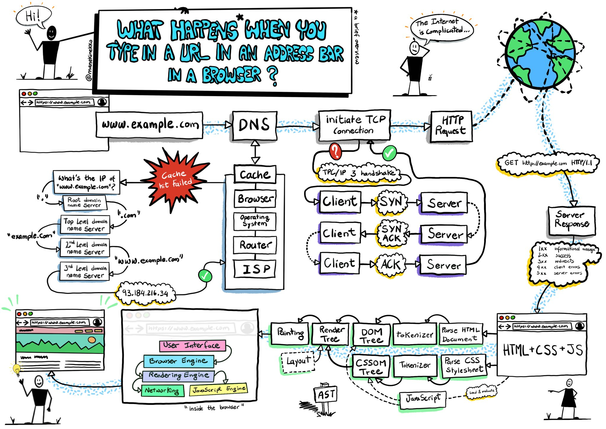

# How does browser work? - in-depth

Created: December 31, 2021 8:36 PM

## Questions:

- What's "the timeline"?
- Critical rendering path?
- FOUC - Flash of unstyled Content?

### Processes and threads

## Navigation Phase

[https://cabulous.medium.com/how-does-browser-work-in-2019-part-ii-navigation-342b27e56d7b](https://cabulous.medium.com/how-does-browser-work-in-2019-part-ii-navigation-342b27e56d7b)

1. Handling user input
2. Sending a URL request
3. Preparing a renderer process
4. Committing navigation
5. Rendering page

## Rendering Phase

[https://cabulous.medium.com/how-does-browser-work-in-2019-part-iii-rendering-phase-i-850c8935958f](https://cabulous.medium.com/how-does-browser-work-in-2019-part-iii-rendering-phase-i-850c8935958f)

[https://medium.com/jspoint/how-the-browser-renders-a-web-page-dom-cssom-and-rendering-df10531c9969](https://medium.com/jspoint/how-the-browser-renders-a-web-page-dom-cssom-and-rendering-df10531c9969)

[https://gist.github.com/faressoft/36cdd64faae21ed22948b458e6bf04d5](https://gist.github.com/faressoft/36cdd64faae21ed22948b458e6bf04d5)

### Parsing

1. HTML parsing - unconventional parsing - Browser will try to figure out proper html tag ending based on some rules (uses **context-free grammar** - to research). HTML DOM Tree is build incrementally by matching tags
    1. CSS parsing (when tag is found) - conventional parsing → separate page about? [https://developer.mozilla.org/en-US/docs/Web/CSS/Specificity](https://developer.mozilla.org/en-US/docs/Web/CSS/Specificity)
    2. JS parsing (when tag is found) - **can interrupt, or restart HTML or CSS parsing!**

#### The script tag.

When HTML parser will encounter *<script>* or *<style>* tag it will parse/execute it immedietaly, meaning multiple parsers *can* run at the same time. What's good to know is that JavaScript can change HTML / CSS on the page, thus block/restart HTML / CSS parsers. For that reason, for scripts that rely on html elements common practice became placin <script> tags at the bottom (so they can reference elements that were parsed before the script execution.

Other solution ate parameters of script tag:

- async="async" - will execute JS **alongside** the other parses thus not blocking them (but might interrupt, and restart)
- defer="defer" - will execute the script only when page has finished parsing

## Render tree calculation

Combines HTML DOM + CSSOM into Render tree

For every render element (which basically is a rectangle) it will decide to render it as none, inline, block, inline-block, or list-item

### Layout (Reflow)

Positioning elements

### Paint

Browser updates styles that is not about layout (not related with position, width or height).

## Critical Rendering Path

### Resources

[The rendering process of a web page.](https://medium.com/@gneutzling/the-rendering-process-of-a-web-page-78e05a6749dc)

[Render-tree Construction, Layout, and Paint | Web Fundamentals](https://developers.google.com/web/fundamentals/performance/critical-rendering-path/render-tree-construction)

[How Browsers Work: Behind the scenes of modern web browsers - HTML5 Rocks](https://www.html5rocks.com/en/tutorials/internals/howbrowserswork/)

[Critical rendering path](https://developer.mozilla.org/en-US/docs/Web/Performance/Critical_rendering_path)

[How the browser renders a web page? - DOM, CSSOM and Rendering](https://medium.com/jspoint/how-the-browser-renders-a-web-page-dom-cssom-and-rendering-df10531c9969)

- [https://cabulous.medium.com/how-browser-works-part-i-process-and-thread-f63a9111bae9](https://cabulous.medium.com/how-browser-works-part-i-process-and-thread-f63a9111bae9)
- [https://cabulous.medium.com/how-does-browser-work-in-2019-part-ii-navigation-342b27e56d7b](https://cabulous.medium.com/how-does-browser-work-in-2019-part-ii-navigation-342b27e56d7b)
-

[Kruno: How browsers work | JSUnconf 2017](https://www.youtube.com/watch?v=0IsQqJ7pwhw)

[Ryan Seddon: So how does the browser actually render a website | JSConf EU 2015](https://www.youtube.com/watch?v=SmE4OwHztCc&t=611s)